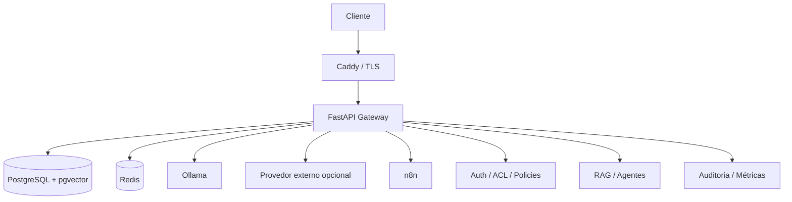

# AI Enterprise Lab

[](https://github.com/waldirevora/ai-enterprise-lab/actions/workflows/ci.yml)

**Idioma:** Português (Brasil) | [English](README_EN.md)

Laboratório de referência local-first para aplicações corporativas de IA com **RAG, agentes de IA, controle de acesso, observabilidade, segurança e práticas reproduzíveis de implantação**.

## Por que este projeto existe

O objetivo não é construir apenas mais um chatbot. O projeto estuda como a IA generativa pode operar dentro de sistemas de software com limites explícitos de confiança, acesso controlado a dados e ferramentas, auditabilidade, execução local de modelos e práticas de engenharia orientadas à produção.

> **Status:** desenvolvimento ativo. Arquitetura central, security hardening, CI, agentes, observabilidade, migrations, backup/recovery e a fundação de runtime de produção estão implementados. O RAG local end-to-end já foi validado e a validação de ACL/RAG autenticado está em andamento.

## Principais capacidades

- Execução local de LLMs com Ollama
- Provedor externo de IA opcional controlado por policy
- Retrieval-Augmented Generation (RAG)
- PostgreSQL + pgvector
- ACL em nível de documento
- Autorização por organização e unidade organizacional
- Agentes de IA com policies explícitas para tools
- Limites de execução deny-by-default
- Rate limiting com Redis
- Eventos de auditoria e logging com atenção à privacidade
- Endpoints de health e readiness
- Observabilidade da aplicação e dos fluxos de IA
- Migrations de banco versionadas
- Procedimentos de backup e recovery
- Runtime com Docker
- Topologia Caddy reverse proxy / TLS
- GitHub Actions CI

## Arquitetura



O gateway FastAPI funciona como plano de controle. Os modelos não decidem de forma independente quais documentos protegidos podem ser recuperados, quais tools podem ser executadas ou se dados podem sair do ambiente local.

## IA local

| Perfil | Modelo |
|---|---|
| `local_fast` | `qwen2.5-coder:3b` |
| `local_deep` | `qwen2.5-coder:7b-instruct-q3_K_S` |
| embeddings | `qwen3-embedding:0.6b` |

Smoke tests validados:

```text
local_fast   7.903 s
local_deep  13.223 s
embedding    8.254 s / 1024 dimensions
```

Essas são medições de uma única execução de smoke test, não benchmarks acadêmicos finais.

## Fluxo RAG

```text
document
→ validation
→ authorization
→ chunking
→ embeddings
→ pgvector
→ retrieval
→ ACL filtering
→ context construction
→ generation
→ audit / metrics
```

A similaridade semântica, sozinha, não torna um documento elegível para retrieval. Autorização e ACL de documento fazem parte da fronteira de acesso do RAG.

## Modelo de segurança

Os controles atuais incluem autenticação, autorização, escopo organizacional, ACL de documentos, trusted hosts/proxies, limites de requisição, rate limiting, sanitização de secrets, eventos de auditoria com atenção à privacidade, policy de egress para providers, auditoria de dependências, runtimes non-root, filesystems read-only quando aplicável, `no-new-privileges` e redução de capabilities.

Secrets reais não são armazenados no Git. Os arquivos de ambiente versionados são apenas templates:

```text
.env.example
infra/.env.prod.example
```

## Health e readiness

```text
GET /health
GET /ready
```

Comportamento validado:

```text
Normal:
health = 200
ready  = 200

Redis unavailable:
health = 200
ready  = 503

Redis recovered:
ready  = 200
```

## Migrations de banco

```bash
python -m app.db.migrations verify
python -m app.db.migrations baseline
python -m app.db.migrations status
python -m app.db.migrations apply
```

A camada de migrations oferece verificação de baseline, migrations ordenadas, comportamento apply-once, validação de checksum SHA-256, advisory locking e status report.

Veja [infra/MIGRATIONS.md](infra/MIGRATIONS.md).

## Topologia de produção

```text
Internet
   |
   v
Caddy :80/:443
   |
   v
FastAPI
   |
   +---- PostgreSQL
   +---- Redis
   +---- AI providers

n8n → loopback-only binding
```

PostgreSQL, Redis e FastAPI não são publicados diretamente na rede do host de produção.

Veja:
- [Ambiente de produção](infra/PRODUCTION_ENV.md)
- [Rollback e recovery](infra/ROLLBACK_RECOVERY.md)
- [Deploy em VPS](infra/VPS_DEPLOYMENT.md)

## Desenvolvimento local

Requisitos: Python 3.12, Docker, Docker Compose, Ollama e Git.

```bash
git clone https://github.com/waldirevora/ai-enterprise-lab.git
cd ai-enterprise-lab

cp .env.example .env

docker compose --env-file .env -f infra/compose.yaml up -d

python -m app.db.migrations status

uvicorn app.main:app --host 127.0.0.1 --port 8000
```

Verificação:

```bash
curl http://127.0.0.1:8000/health
curl http://127.0.0.1:8000/ready
```

Nunca faça commit do `.env`.

## Testes

Baseline atualmente validado:

```text
424 passed
```

A suíte cobre autenticação, autorização, unidades organizacionais, RAG, enforcement de ACL, agentes, policies de agentes, rate limiting, auditoria, privacidade, providers, readiness, migrations, security headers, configuração de produção e contratos de deployment.

```bash
pytest -q
```

## Status do projeto

| Área | Status |
|---|---|
| Gateway FastAPI | Concluído |
| PostgreSQL / pgvector | Concluído |
| Autenticação / autorização | Concluído |
| Implementação RAG | Concluído |
| Agentes / orquestração | Concluído |
| Security hardening | Concluído |
| Privacy review | Concluído |
| Observabilidade | Concluído |
| CI | Concluído |
| Framework de migrations | Concluído |
| Backup / recovery | Concluído |
| Fundação de runtime de produção | Concluído |
| Runtime local | Validado |
| Geração LLM local | Validada |
| Embeddings locais | Validados |
| RAG end-to-end local | Validado |
| ACL / RAG autenticado | Em validação |
| Deploy real em VPS | Pendente |
| Continuous deployment | Planejado |
| Benchmarking acadêmico | Em andamento |

## Escopo acadêmico

O AI Enterprise Lab também está estruturado como projeto acadêmico aplicado em torno da seguinte questão:

> Como estruturar e validar uma arquitetura local e privada de inteligência artificial generativa capaz de integrar RAG, agentes, APIs, controle de acesso, persistência, segurança e observabilidade, mantendo rastreabilidade e condições de implantação empresarial?

O plano experimental inclui latência de geração, desempenho de embeddings, qualidade de retrieval, Hit@k, MRR, enforcement de ACL, falha/recuperação, persistência, idempotência de migrations, backup/restore e uso de CPU/RAM/VRAM.

## Roadmap

1. Concluir a validação local de ACL e RAG autenticado.
2. Validar a execução local de agentes e tools.
3. Validar persistência e restart.
4. Validar backup e restore.
5. Coletar medições acadêmicas reproduzíveis.
6. Executar o primeiro deployment manual em VPS.
7. Validar DNS público, firewall e ACME.
8. Adicionar continuous deployment controlado.
9. Empacotar o projeto como versão reproduzível `v1.0`.

## Licença

Nenhuma licença open source foi selecionada até o momento. A visibilidade pública do repositório não concede automaticamente permissão para copiar, modificar ou redistribuir o código-fonte além dos direitos previstos pela legislação aplicável.

## Autor

**Waldir Évora**

IA Aplicada · Automação Digital · Sistemas e Integrações · Python/Backend · RAG · Agentes de IA
