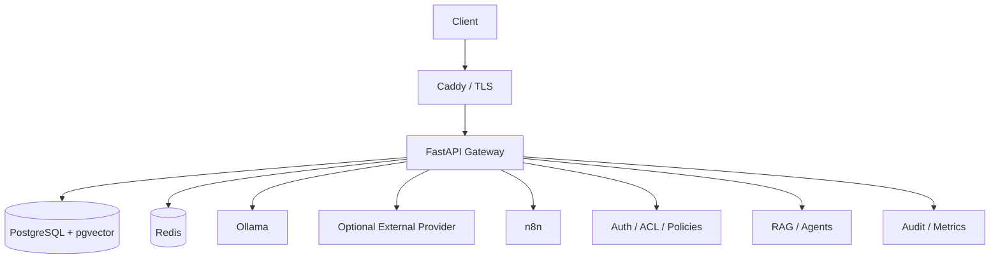

# AI Enterprise Lab

[](https://github.com/waldirevora/ai-enterprise-lab/actions/workflows/ci.yml)

**Language:** [Português (Brasil)](README.md) | English

Local-first reference lab for enterprise-oriented AI applications with **RAG, AI agents, access control, observability, security controls, and reproducible deployment practices**.

## Why this project exists

The goal is not to build another chatbot. The project studies how generative AI can operate inside software systems with explicit trust boundaries, controlled access to data and tools, auditability, local model execution, and production-oriented engineering.

> **Status:** active development. Core architecture, security hardening, CI, agents, observability, migrations, backup/recovery, and production runtime foundation are implemented. Local RAG end-to-end has been validated, and ACL/authenticated RAG validation is in progress.

## Core capabilities

- Local LLM execution with Ollama
- Optional external AI provider controlled by policy
- Retrieval-Augmented Generation (RAG)
- PostgreSQL + pgvector
- Document-level ACL
- Organization and organizational-unit authorization
- AI agents with explicit tool policies
- Deny-by-default execution boundaries
- Redis-backed rate limiting
- Audit events and privacy-aware logging
- Health and readiness endpoints
- Application and AI observability
- Versioned database migrations
- Backup and recovery procedures
- Docker runtime
- Caddy reverse proxy / TLS topology
- GitHub Actions CI

## Architecture



The FastAPI gateway acts as the control plane. Models do not independently decide which protected documents may be retrieved, which tools may run, or whether data may leave the local environment.

## Local AI

| Profile | Model |
|---|---|
| `local_fast` | `qwen2.5-coder:3b` |
| `local_deep` | `qwen2.5-coder:7b-instruct-q3_K_S` |
| embeddings | `qwen3-embedding:0.6b` |

Validated smoke tests:

```text
local_fast   7.903 s
local_deep  13.223 s
embedding    8.254 s / 1024 dimensions
```

These are single-run smoke measurements, not final academic benchmarks.

## RAG flow

```text
document
→ validation
→ authorization
→ chunking
→ embeddings
→ pgvector
→ retrieval
→ ACL filtering
→ context construction
→ generation
→ audit / metrics
```

Semantic similarity alone is not enough to make a document eligible for retrieval. Authorization and document ACLs are part of the retrieval boundary.

## Security model

Current controls include authentication, authorization, organizational scope, document ACLs, trusted hosts/proxies, request limits, rate limiting, secret sanitization, privacy-aware audit events, provider egress policy, dependency auditing, non-root runtimes, read-only filesystems where applicable, `no-new-privileges`, and capability reduction.

Real secrets are not stored in Git. Versioned environment files are templates only:

```text
.env.example
infra/.env.prod.example
```

## Health and readiness

```text
GET /health
GET /ready
```

Validated behavior:

```text
Normal:
health = 200
ready  = 200

Redis unavailable:
health = 200
ready  = 503

Redis recovered:
ready  = 200
```

## Database migrations

```bash
python -m app.db.migrations verify
python -m app.db.migrations baseline
python -m app.db.migrations status
python -m app.db.migrations apply
```

The migration layer provides baseline verification, ordered migrations, apply-once behavior, SHA-256 checksum validation, advisory locking, and status reporting.

See [infra/MIGRATIONS.md](infra/MIGRATIONS.md).

## Production topology

```text
Internet
   |
   v
Caddy :80/:443
   |
   v
FastAPI
   |
   +---- PostgreSQL
   +---- Redis
   +---- AI providers

n8n → loopback-only binding
```

PostgreSQL, Redis, and FastAPI are not directly published to the production host network.

See:
- [Production environment](infra/PRODUCTION_ENV.md)
- [Rollback and recovery](infra/ROLLBACK_RECOVERY.md)
- [VPS deployment](infra/VPS_DEPLOYMENT.md)

## Local development

Requirements: Python 3.12, Docker, Docker Compose, Ollama, and Git.

```bash
git clone https://github.com/waldirevora/ai-enterprise-lab.git
cd ai-enterprise-lab

cp .env.example .env

docker compose --env-file .env -f infra/compose.yaml up -d

python -m app.db.migrations status

uvicorn app.main:app --host 127.0.0.1 --port 8000
```

Verify:

```bash
curl http://127.0.0.1:8000/health
curl http://127.0.0.1:8000/ready
```

Never commit `.env`.

## Tests

Current validated baseline:

```text
417 passed
```

The suite covers authentication, authorization, organizational units, RAG, ACL enforcement, agents, agent policies, rate limiting, audit, privacy, providers, readiness, migrations, security headers, production configuration, and deployment contracts.

```bash
pytest -q
```

## Project status

| Area | Status |
|---|---|
| FastAPI gateway | Complete |
| PostgreSQL / pgvector | Complete |
| Authentication / authorization | Complete |
| RAG implementation | Complete |
| Agents / orchestration | Complete |
| Security hardening | Complete |
| Privacy review | Complete |
| Observability | Complete |
| CI | Complete |
| Migration framework | Complete |
| Backup / recovery | Complete |
| Production runtime foundation | Complete |
| Local runtime | Validated |
| Local LLM generation | Validated |
| Local embeddings | Validated |
| Local RAG end-to-end | Validated |
| ACL / authenticated RAG | In validation |
| Real VPS deployment | Pending |
| Continuous deployment | Planned |
| Academic benchmarking | In progress |

## Academic scope

AI Enterprise Lab is also structured as an applied academic project around this question:

> How can a local and private generative AI architecture integrate RAG, agents, APIs, access control, persistence, security, and observability while preserving traceability and deployability?

The experimental plan includes generation latency, embedding performance, retrieval quality, Hit@k, MRR, ACL enforcement, failure/recovery, persistence, migration idempotency, backup/restore, and CPU/RAM/VRAM usage.

## Roadmap

1. Complete local ACL and authenticated RAG validation.
2. Validate agent/tool execution locally.
3. Validate persistence and restart behavior.
4. Validate backup and restore.
5. Collect reproducible academic measurements.
6. Execute the first manual deployment on a VPS.
7. Validate public DNS, firewall, and ACME.
8. Add controlled continuous deployment.
9. Package the project as a reproducible `v1.0`.

## License

No open-source license has been selected yet. Public visibility does not automatically grant permission to copy, modify, or redistribute the source code beyond rights provided by applicable law.

## Author

**Waldir Évora**

Applied AI · Digital Automation · Systems & Integrations · Python/Backend · RAG · AI Agents
